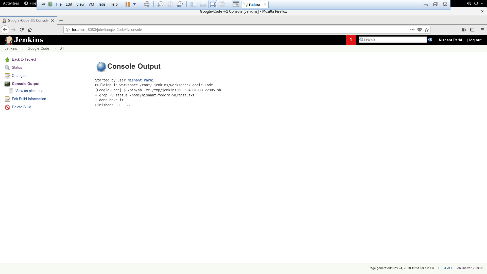

# Shell execution from Jenkins

After going through this README you will learn how to execute a shell script from ansible, and remove the word status from it:

1) How to run a simple shell script which triggers grub command on jenkins.
2) Run the jenkins server, and go to http://localhost:(Your-port)
3) After the login you need to create a job, and then name it.
4) The project should be in freestyle mode.
5) You will be now presented with a form, go to "Build" and in the drop menu select execute shell, in the shell box type the script written in `rm-status.sh` and save it.
6) Now create a .txt file and write some sentence in there with the word status and some without status.
7) Now on the project dashboard click on the build now option.
8) After some seconds you will find a box on the left side, Build History.
9) If the ball has turned blue, VOILA!. If it tuned red then there must be an error while running, try troubleshooting.
10) Click on the Build on the history, and it takes you to another page. On that page click console output to see you results.

##### Note: If the script doesn't execute, try `sudo chmod 777 < your-file >`
